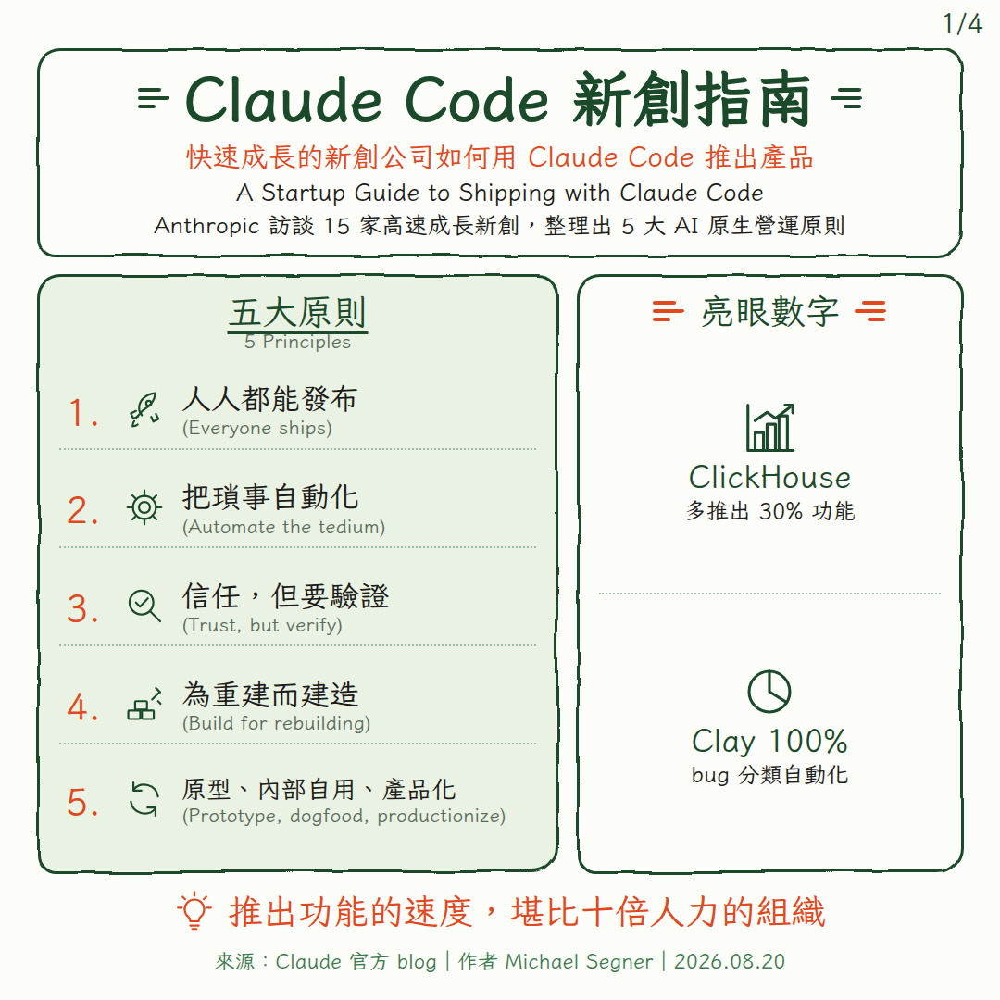
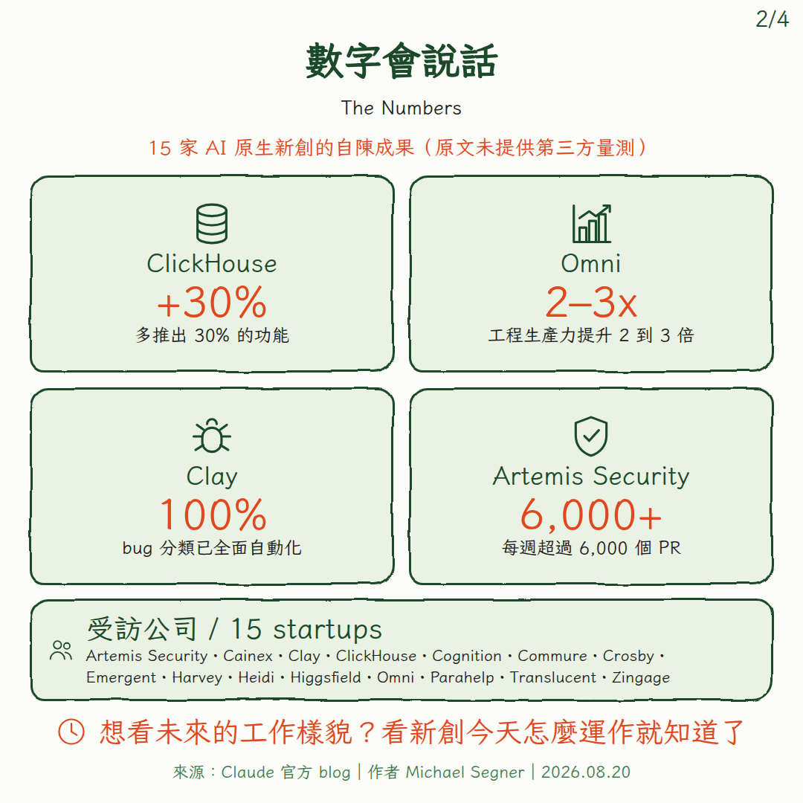
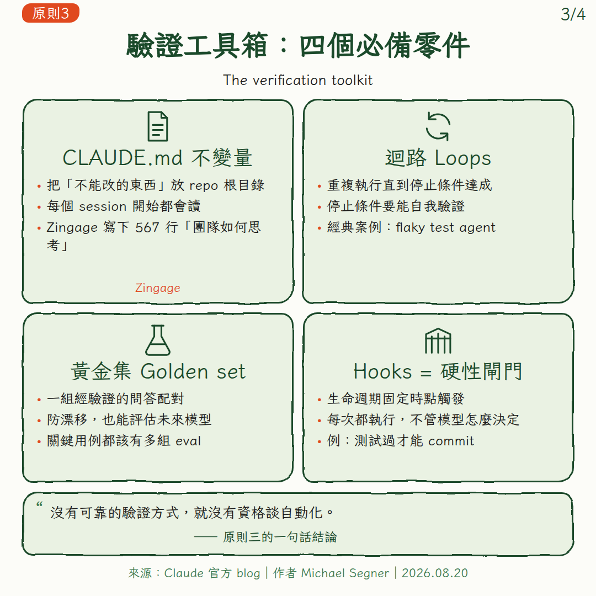
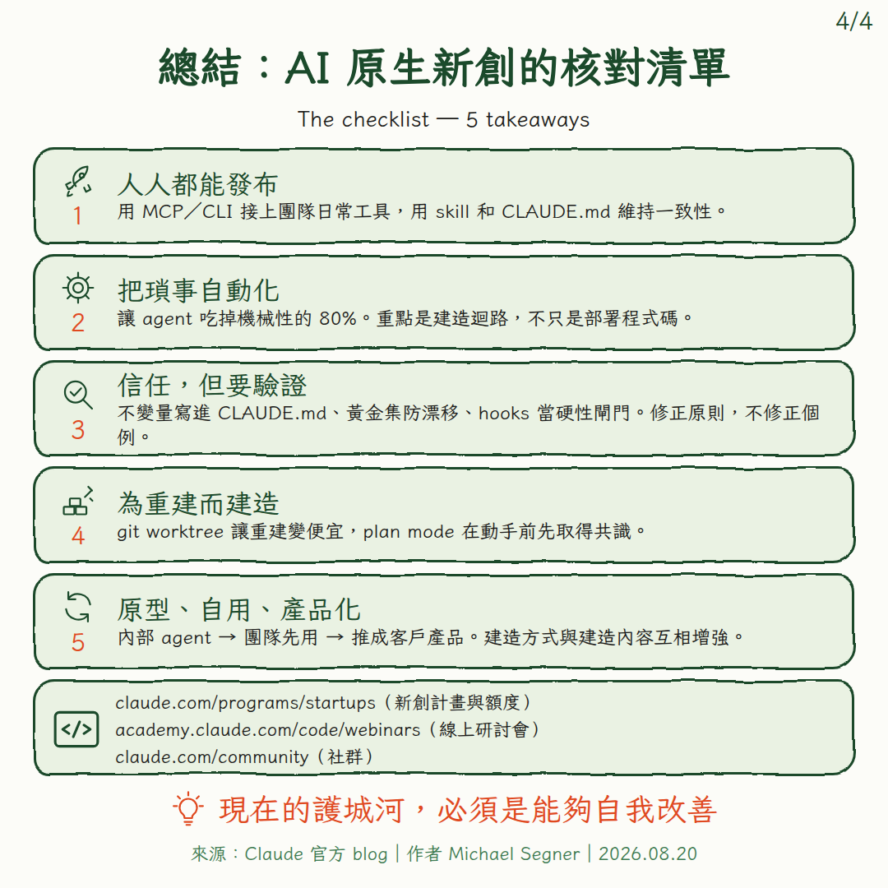

# knowledge-card

> 中文手繪風知識圖卡產生器 — 一個 Claude Skill

把一篇文章、一場會議結論、一份產品比較，壓成**可直接轉發到群組的 1:1 方形圖卡**。
深森綠框線 ＋ 朱橘重點 ＋ 淺薄荷綠面板 ＋ 繁體手寫字體，單張或十連張成套。

**核心設計決定：不用生圖模型。** 圖卡的價值 100% 在文字，生圖模型無法保證繁體中文字形正確、也無法讓十張維持同一風格。
這裡走 `content.json → HTML/CSS → Chromium 截圖`，文字 100% 精確、風格 100% 一致。

<p align="center">
  
  
</p>
<p align="center">
  
  
</p>

---

## 安裝

放進你的 skills 目錄即可：

```bash
git clone https://github.com/MDs227/knowledge-card.git ~/.claude/skills/knowledge-card
```

或作為專案內 skill：`<project>/.agents/skills/knowledge-card/`。

首次使用前安裝手寫字體（Iansui 芫荽，SIL OFL）：

```bash
bash assets/fonts.sh
```

依賴：Python 3、Playwright（Chromium）、fontconfig。

## 用法

```bash
python3 scripts/build.py content.json out/    # JSON → HTML
python3 scripts/shot.py out/                  # HTML → PNG（1080×1080）
```

`content.json` 欄位定義見 `references/content-schema.md`，可直接改 `examples/claude-code-startups.json` 起手。

在 Claude 中，只要說「把這篇做成圖卡」「做個懶人包給群組看」，skill 會自動觸發並跑完五步流程。

## 五種頁型

| `type` | 用在 | 結構 |
|---|---|---|
| `cover` | 開場／總覽 | 大標＋雙語副標；左清單、右數字；底部金句 |
| `numbers` | 數字牆 | 2×2 數字方格＋底部名單條 |
| `contrast` | 前後對比 | 左「過去」右「現在」＋中間箭頭寫轉變機制 |
| `panels` | 拆解（**最常用**） | 2×3 或 3 欄面板網格，每格一個子概念 |
| `checklist` | 收尾核對 | 編號條列＋下一步區塊＋全篇金句 |

成套建議：`cover` → `numbers` → `panels` → `checklist`。單張用途直接用 `panels`。

## 內容紀律（讓卡好讀的真正原因）

1. **每格 ≤4 條要點、每條 ≤20 字。** 塞不下就多開一張卡，不要縮字級。
2. **朱橘色元素每張 ≤3 處**（標籤／關鍵數字／底部金句）。這是風格不亂的唯一原因。
3. **雙語只做在術語層**：主標／小標中英並列，內文純中文。
4. **底部金句要能獨立轉發**——這張卡被單獨截圖轉出去時，只有它會被讀到。
5. **不製造來源沒有的東西**：不外插數字、不補未查證的歸屬；頁尾出處欄不可省。

## 設計系統

```
--ink    #1B4A2B   深森綠：框線／標題／圖示
--ink-2  #3C7A50   中綠：頁尾／英文小字
--accent #E0491F   朱橘：數字／金句／標籤（唯一暖色）
--body   #1C1C1A   內文黑
--panel  #EAF2E3   淺薄荷綠：面板底
--paper  #FCFCF8   紙白：背景
```

畫布 1080×1080；外距 上 52／左右 40／下 30；框線 3px；圓角四角不等值（手繪的不對稱感來源）。
手繪框線用 SVG 位移濾鏡實作，**只套在 border 層、不套文字層**（否則中文筆畫會黏連）。
完整規格見 `references/design-spec.md`。

## 檔案結構

```
SKILL.md                      skill 主檔（鐵律＋五步流程＋常見錯誤表）
assets/card.css               設計系統
assets/icons.svg              手繪風單線圖示庫
assets/fonts.sh               Iansui 字體下載安裝
scripts/build.py              content.json → HTML（五種頁型）
scripts/shot.py               Playwright 批次截圖
references/design-spec.md     完整版面／配色／內容文法
references/content-schema.md  content.json 欄位定義
examples/                     範例 content.json 與成品 PNG
```

## 授權

程式與文件採 MIT（見 `LICENSE`）。
字體 Iansui（芫荽）由 `assets/fonts.sh` 於執行時下載，採 SIL Open Font License 1.1，不隨本 repo 散布。
